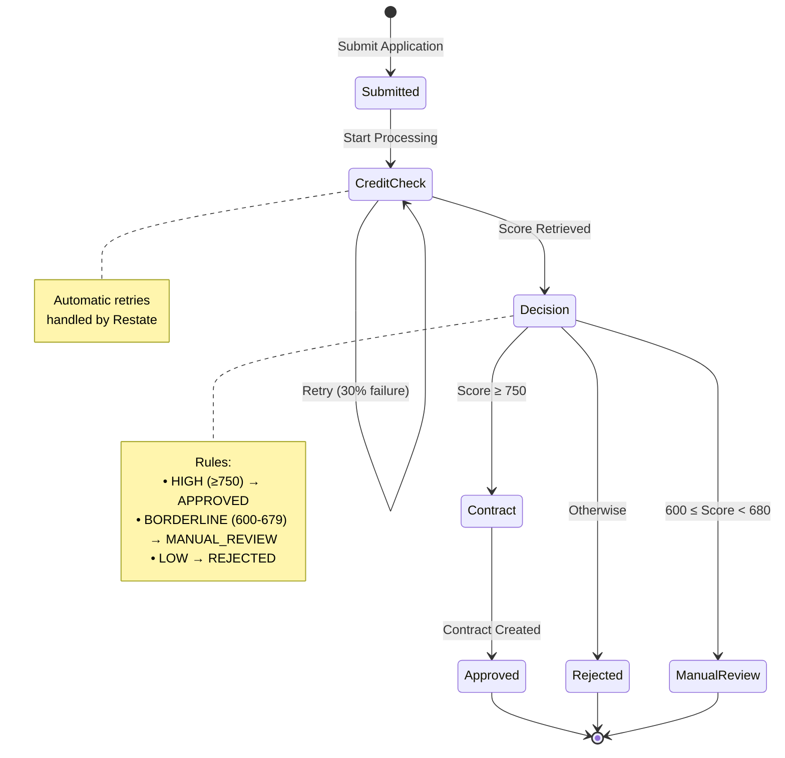
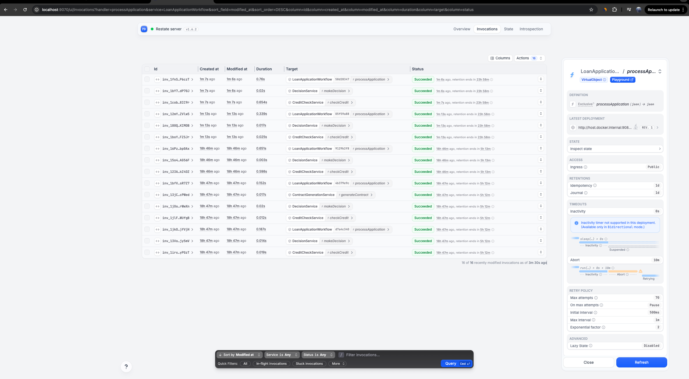
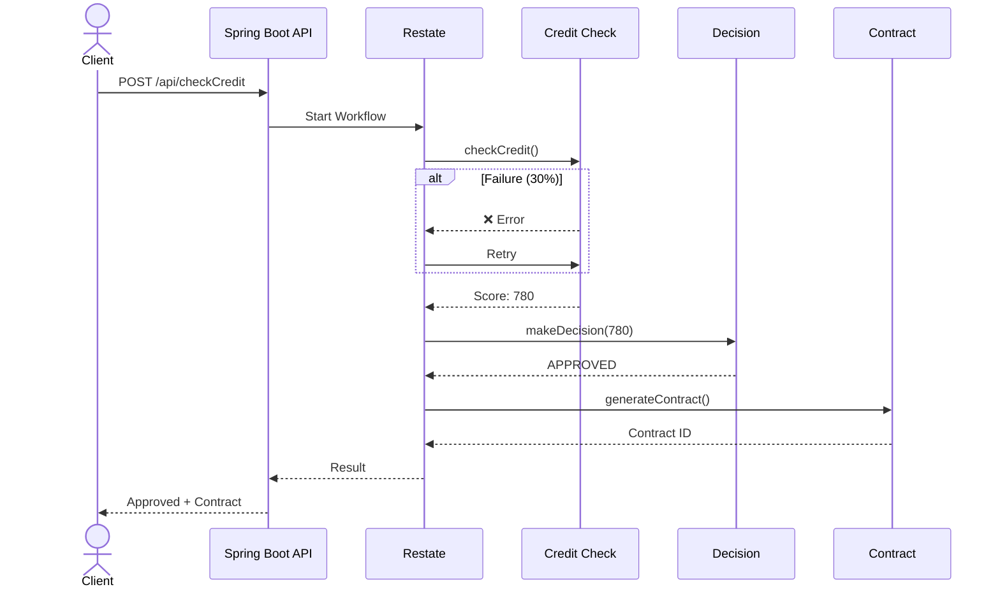

# Restate Loan Application POC

A proof-of-concept demonstrating durable workflow execution with Restate, Kotlin, and Spring Boot.

## Overview

This project shows how to build a loan application workflow that:
- ✅ Survives crashes and restarts (durable execution)
- ✅ Automatically retries failed operations
- ✅ Orchestrates multiple microservices
- ✅ Maintains complete audit trails

## Workflow State Machine



## Quick Start

### 1. Start Restate Server

```bash
docker run --name restate_dev --rm -d \
  -p 8080:8080 -p 9070:9070 \
  --add-host=host.docker.internal:host-gateway \
  docker.io/restatedev/restate:latest
```

### 2. Build and Run Application

```bash
./gradlew build
./gradlew bootRun
```

### 3. Register Services

```bash
curl -X POST http://localhost:9070/deployments \
  -H 'Content-Type: application/json' \
  -d '{"uri": "http://host.docker.internal:9080", "use_http_11": true}'
```

### 4. Test the Workflow

```bash
curl -X POST http://localhost:8081/api/checkCredit \
  -H "Content-Type: application/json" \
  -d '{
    "applicantName": "John Doe",
    "amount": 50000,
    "income": 100000
  }'
```

### 5. View Workflow State

Open the Restate UI: **http://localhost:9070/ui/**




## Workflow Sequence



## Decision Rules

| Credit Score | Decision | Action |
|--------------|----------|--------|
| 750-850 | ✅ APPROVED | Generate contract |
| 680-749 | ❌ REJECTED | Application denied |
| 600-679 | ⏳ MANUAL_REVIEW | Pending review |
| 300-599 | ❌ REJECTED | Application denied |

Credit score is calculated from income-to-loan ratio:
- Ratio ≥ 5.0 → Score ~750-850
- Ratio ≥ 2.0 → Score ~550-650
- Ratio < 1.0 → Score ~300-450

## Architecture

```
┌─────────┐
│ Client  │
└────┬────┘
     │ POST /api/checkCredit
     ▼
┌──────────────────┐
│ Spring Boot API  │  (port 8081)
└────┬─────────────┘
     │ Restate Client
     ▼
┌──────────────────┐         ┌────────────────────┐
│ Restate Server   │◄────────┤ Services Endpoint  │
│ (8080 / 9070)    │         │ (port 9080)        │
└──────────────────┘         │                    │
                             │ • CreditCheck      │
                             │ • Decision         │
                             │ • Contract         │
                             │ • LoanWorkflow     │
                             └────────────────────┘
```

### Components

- **LoanApplicationWorkflow** - Virtual Object (stateful, keyed by applicationId)
- **CreditCheckService** - Service (stateless, with simulated failures)
- **DecisionService** - Service (business rules)
- **ContractGenerationService** - Service (document generation)

## Example Responses

**Approved:**
```json
{
  "applicationId": "a1b2c3",
  "decision": "APPROVED",
  "creditScore": 780,
  "message": "Congratulations! Your loan has been approved.",
  "contractId": "CONTRACT-a1b2c3-1713542400"
}
```

**Rejected:**
```json
{
  "applicationId": "x9y8z7",
  "decision": "REJECTED",
  "creditScore": 520,
  "message": "We're sorry, your application has been rejected."
}
```

**Manual Review:**
```json
{
  "applicationId": "m5n6p7",
  "decision": "MANUAL_REVIEW",
  "creditScore": 640,
  "message": "Application pending manual review."
}
```

## Monitoring

- **Web UI**: http://localhost:9070/ui/
- **Services API**: `curl http://localhost:9070/services`
- **Invocations API**: `curl http://localhost:9070/invocations`

## Key Features

| Feature | Description |
|---------|-------------|
| 🔄 Durable Execution | Workflows survive crashes and restarts |
| ♻️ Automatic Retries | Failed operations retry automatically (30% simulated failure) |
| 🎯 Type Safety | Full Kotlin type checking with KSP code generation |
| 📊 Observability | Built-in workflow state tracking via Restate UI |
| ⚡ RPC-Style Calls | Natural async/await instead of activity stubs |

---

## Technical Details

**Stack:**
- Kotlin 2.1.0
- Spring Boot 3.4.1
- Restate SDK 2.5.0
- Kotlin Coroutines + KSP

**Project Structure:**
```
src/main/kotlin/org/example/
├── model/LoanModels.kt                    # Data models
├── service/
│   ├── CreditCheckService.kt              # Credit scoring
│   ├── DecisionService.kt                 # Business rules
│   └── ContractGenerationService.kt       # Document generation
├── workflow/LoanApplicationWorkflow.kt    # Main workflow (Virtual Object)
├── controller/LoanController.kt           # REST API
└── LoanApplication.kt                     # Main entry point
```

**Ports:**
- `8080` - Restate Ingress API
- `9070` - Restate Admin API + Web UI
- `9080` - Application Services Endpoint
- `8081` - Spring Boot REST API
