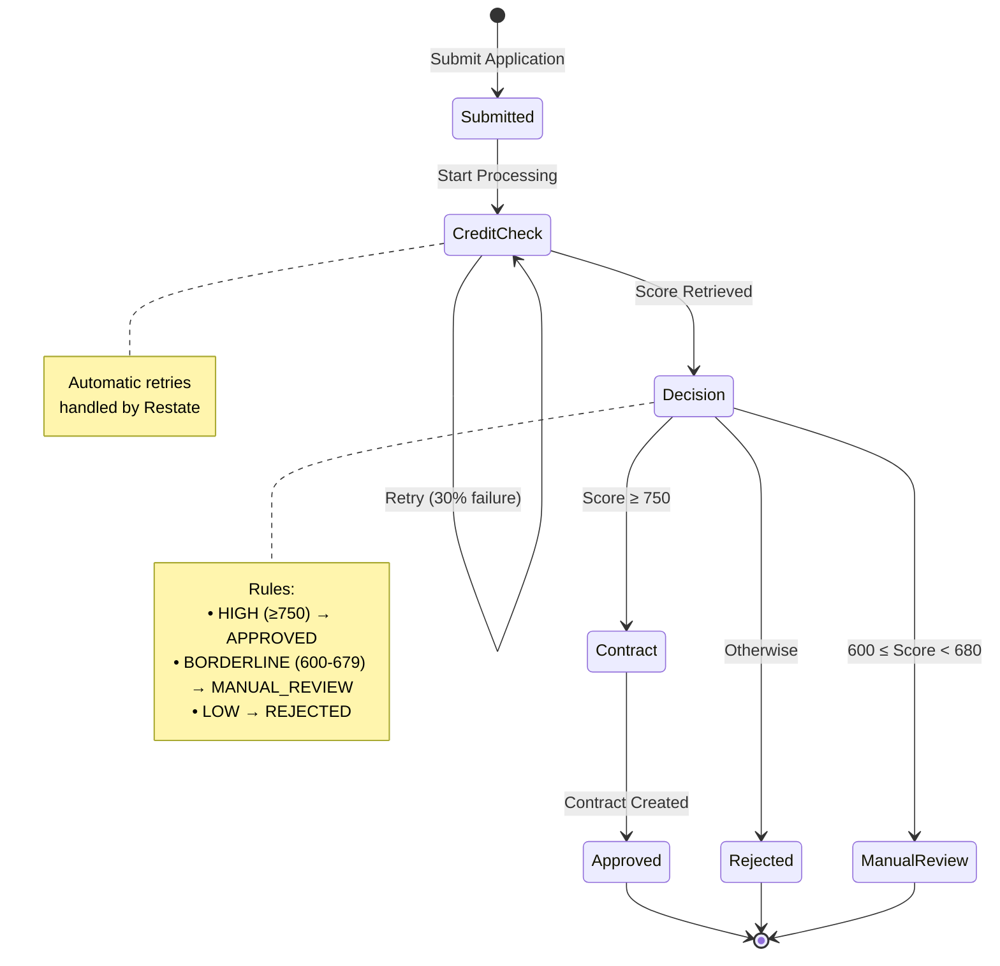
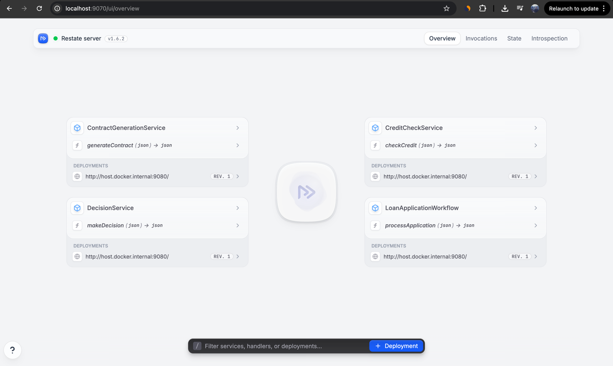
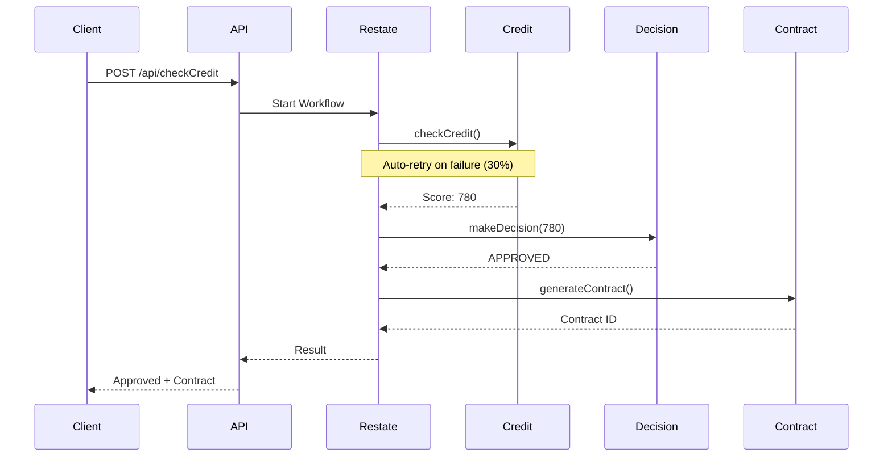

# Restate Loan Application POC

Durable workflow execution with Restate, Kotlin, and Spring Boot.

**Features:** Durable execution • Automatic retries • Service orchestration • Complete audit trails

## Workflow State Machine



## Quick Start

```bash
# Start Restate
docker-compose up -d

# Build and run application
./gradlew build && ./gradlew bootRun
```

In a new terminal:
```bash
# Register services
curl -X POST http://localhost:9070/deployments \
  -H 'Content-Type: application/json' \
  -d '{"uri":"http://host.docker.internal:9080","use_http_11":true}'

# Test workflow
curl -X POST http://localhost:8081/api/checkCredit \
  -H 'Content-Type: application/json' \
  -d '{"applicantName":"John Doe","amount":50000,"income":100000}'
```

**Web UI:** http://localhost:9070/ui/



## Sequence Diagram



## Decision Rules

| Score | Decision | Income/Loan Ratio |
|-------|----------|-------------------|
| 750-850 | ✅ APPROVED | ≥ 5.0 |
| 680-749 | ❌ REJECTED | 3.0-4.9 |
| 600-679 | ⏳ MANUAL_REVIEW | 2.0-2.9 |
| < 600 | ❌ REJECTED | < 2.0 |

## Architecture

```
Client → Spring Boot API (8081) → Restate Server (8080/9070) ← Services (9080)
                                                                  • CreditCheck
                                                                  • Decision
                                                                  • Contract
                                                                  • Workflow
```

**Components:**
- **LoanApplicationWorkflow** - Virtual Object (stateful)
- **CreditCheckService** - Stateless (30% simulated failures)
- **DecisionService** - Business rules
- **ContractGenerationService** - Document generation

## Monitoring

- **Web UI**: http://localhost:9070/ui/
- **Services**: `curl http://localhost:9070/services`
- **Invocations**: `curl http://localhost:9070/invocations`

---

## Tech Stack

**Stack:** Kotlin 2.1.0 • Spring Boot 3.4.1 • Restate SDK 2.5.0

**Ports:**
- `8080` - Restate Ingress
- `9070` - Admin + Web UI
- `9080` - Services Endpoint
- `8081` - REST API

**Structure:**
```
src/main/kotlin/org/example/
├── model/              # Data models
├── service/            # Credit, Decision, Contract services
├── workflow/           # LoanApplicationWorkflow (Virtual Object)
├── controller/         # REST API
└── LoanApplication.kt  # Main entry point
```
