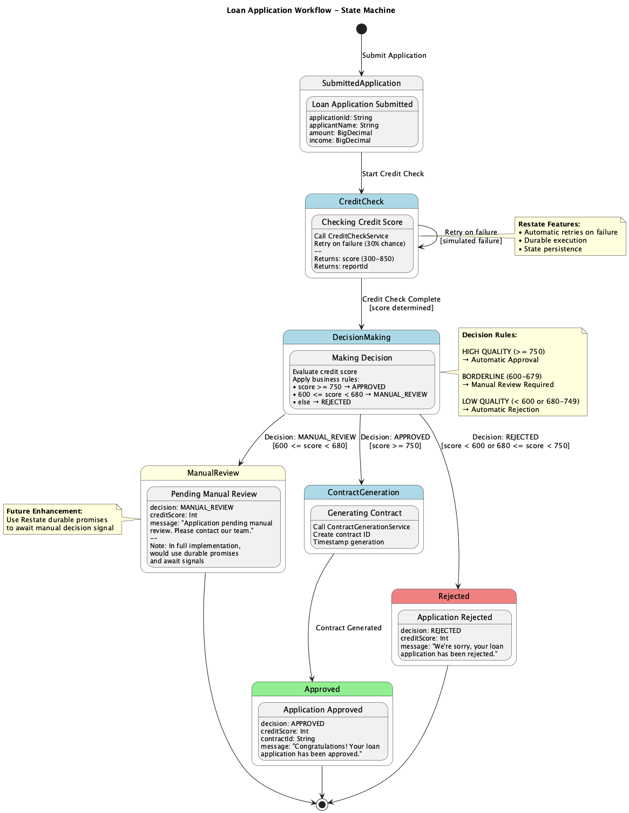
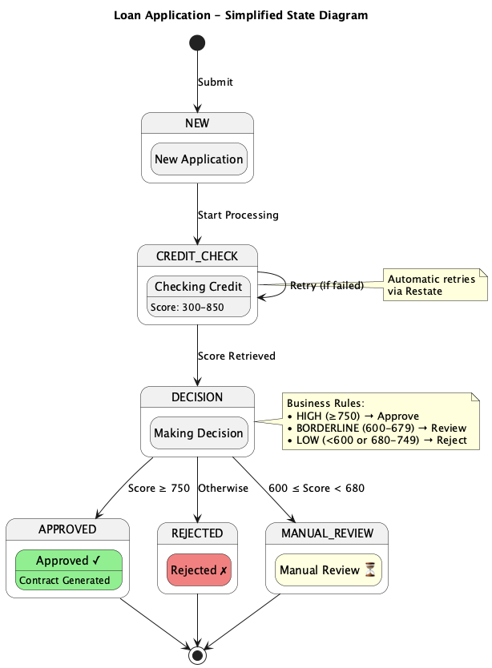
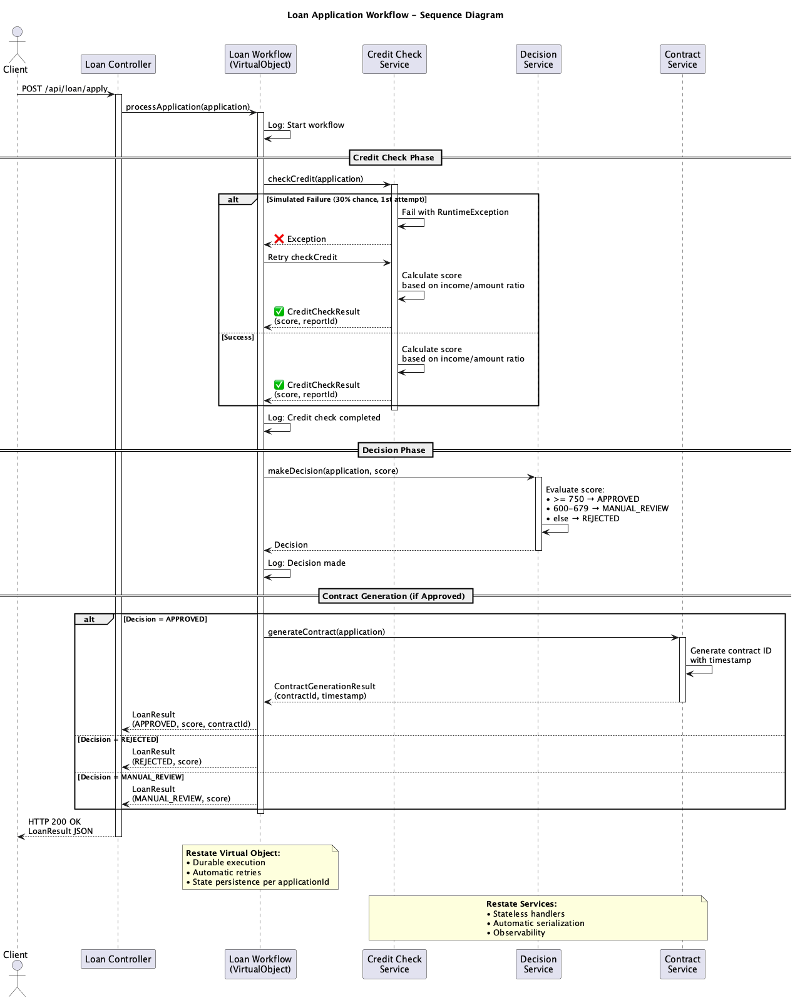

# Loan Application Workflow - Documentation

## Overview

This directory contains PlantUML diagrams documenting the Loan Application Workflow implemented with Restate.

## Diagrams

### 1. State Machine Diagram (`loan-workflow-state-machine.puml`)

Detailed state machine showing all possible states and transitions in the loan application process.



**Also available in Mermaid format**: See `workflow-state-machine.md` for GitHub/GitLab compatible diagrams.

**States:**
- **Submitted Application** - Initial state with application data
- **Credit Check** - Processing credit score (with automatic retry capability)
- **Decision Making** - Applying business rules to determine outcome
- **Contract Generation** - Creating contract for approved applications
- **Approved** (Final) - Loan approved with contract
- **Rejected** (Final) - Loan rejected
- **Manual Review** (Final) - Pending manual review

**Decision Rules:**
- Score >= 750 → APPROVED
- 600 <= Score < 680 → MANUAL_REVIEW
- Score < 600 or 680 <= Score < 750 → REJECTED

### 2. Simplified State Diagram (`loan-workflow-simple.puml`)

Simplified state machine for quick understanding of the workflow states.



### 3. Sequence Diagram (`loan-workflow-sequence.puml`)

Shows the interaction flow between components during loan application processing.



**Components:**
- Client
- Loan Controller (REST API)
- Loan Workflow (Restate Virtual Object)
- Credit Check Service
- Decision Service
- Contract Generation Service

## Viewing the Diagrams

### Option 1: Online PlantUML Editor

1. Go to [PlantUML Online Editor](http://www.plantuml.com/plantuml/uml/)
2. Copy the content of the `.puml` file
3. Paste it into the editor
4. View the rendered diagram

### Option 2: VS Code Extension

1. Install the "PlantUML" extension in VS Code
2. Open any `.puml` file
3. Press `Alt+D` to preview the diagram

### Option 3: Command Line (requires PlantUML and Graphviz)

```bash
# Install PlantUML and Graphviz
brew install plantuml graphviz  # macOS
# or
apt-get install plantuml graphviz  # Linux

# Generate PNG images
plantuml docs/loan-workflow-state-machine.puml
plantuml docs/loan-workflow-sequence.puml
```

### Option 4: IntelliJ IDEA Plugin

1. Install "PlantUML Integration" plugin
2. Open any `.puml` file
3. The diagram will render automatically in the preview pane

## Restate Features Demonstrated

### Virtual Objects
- **LoanApplicationWorkflow** - Stateful workflow with durable execution
- Each application has its own state, keyed by `applicationId`

### Services
- **CreditCheckService** - Stateless service with retry capability
- **DecisionService** - Business rule evaluation
- **ContractGenerationService** - Document generation

### Key Benefits
- **Durable Execution** - Workflow state persists across failures
- **Automatic Retries** - Failed operations retry automatically
- **Observability** - Built-in logging and tracing
- **Type Safety** - Kotlin with full type checking

## Architecture Notes

### Current Implementation (POC)
- Direct service calls using generated KSP clients
- Manual review returns immediately with pending status

### Future Enhancements
- Use Restate **Durable Promises** for manual review workflow
- Add **Awakeable** for human-in-the-loop decision
- Implement saga pattern for compensation logic
- Add event sourcing for audit trail

## Business Logic Summary

### Credit Score Calculation
Based on income-to-loan ratio:
- Ratio >= 5.0 → Score: 750-850 (Excellent)
- Ratio >= 3.0 → Score: 650-750 (Good)
- Ratio >= 2.0 → Score: 550-650 (Fair)
- Ratio >= 1.0 → Score: 450-550 (Poor)
- Ratio < 1.0 → Score: 300-450 (Very Poor)

### Simulated Failures
- 30% chance of failure on first credit check attempt
- Demonstrates Restate's automatic retry mechanism

## Related Files

- Source code: `src/main/kotlin/org/example/workflow/LoanApplicationWorkflow.kt`
- Services: `src/main/kotlin/org/example/service/`
- Models: `src/main/kotlin/org/example/model/LoanModels.kt`
- Controller: `src/main/kotlin/org/example/controller/LoanController.kt`
