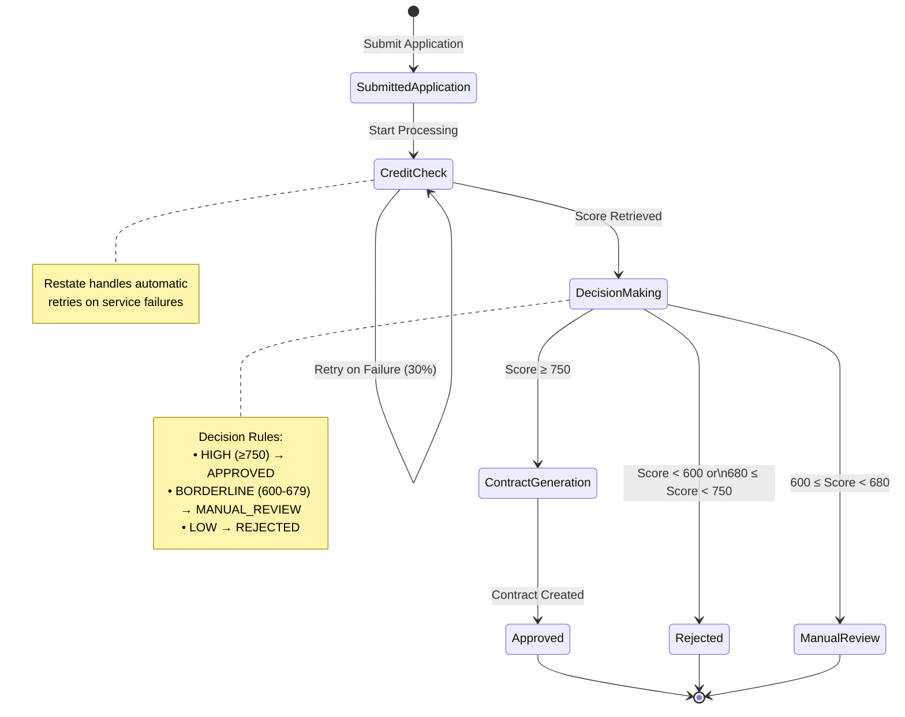
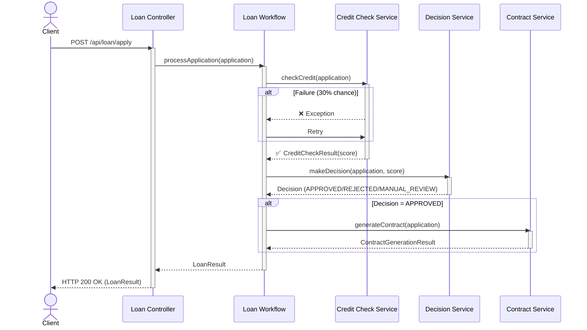

# Loan Application Workflow - State Machine (Mermaid)

## State Diagram

## Sequence Diagram

## States Description

### Processing States

1. **SubmittedApplication**
   - Initial state when application is received
   - Contains: applicationId, applicantName, amount, income

2. **CreditCheck**
   - Calls external credit check service
   - Calculates score (300-850) based on income/amount ratio
   - Simulates failures for demo (30% chance on first attempt)
   - Automatic retries via Restate

3. **DecisionMaking**
   - Applies business rules to credit score
   - Determines final decision

4. **ContractGeneration** (only for APPROVED)
   - Generates contract document
   - Creates unique contract ID with timestamp

### Final States

1. **Approved** ✅
   - Credit score ≥ 750
   - Contract generated
   - Application fully approved

2. **Rejected** ❌
   - Credit score < 600 or 680 ≤ score < 750
   - Application denied

3. **ManualReview** ⏳
   - Credit score between 600-679
   - Requires human review
   - In full implementation: uses Restate durable promises

## Decision Logic

| Credit Score Range | Decision | Action |
|-------------------|----------|--------|
| 750 - 850 | APPROVED | Generate contract |
| 680 - 749 | REJECTED | No contract |
| 600 - 679 | MANUAL_REVIEW | Pending review |
| 300 - 599 | REJECTED | No contract |

## Restate Benefits

- **Durable Execution**: Workflow state persists across failures
- **Automatic Retries**: Failed operations retry without manual intervention
- **Type Safety**: Full Kotlin type checking with KSP code generation
- **Observability**: Built-in logging and distributed tracing
- **Exactly-Once Semantics**: Each step executes exactly once

## Implementation Details

### Virtual Object
`LoanApplicationWorkflow` - Stateful workflow keyed by `applicationId`

### Services
- `CreditCheckService` - Stateless credit score calculator
- `DecisionService` - Business rule engine
- `ContractGenerationService` - Document generator

### Generated Clients (via KSP)
- `CreditCheckServiceClient`
- `DecisionServiceClient`
- `ContractGenerationServiceClient`
